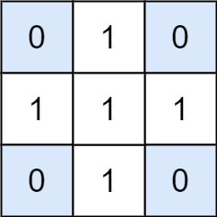

给出矩阵 ```matrix``` 和目标值 ```target```，返回元素总和等于目标值的非空子矩阵的数量。

子矩阵 ```x1, y1, x2, y2``` 是满足 ```x1 <= x <= x2``` 且 ```y1 <= y <= y2``` 的所有单元 ```matrix[x][y]``` 的集合。

如果 ```(x1, y1, x2, y2)``` 和 ```(x1', y1', x2', y2')``` 两个子矩阵中部分坐标不同（如：```x1 != x1'```），那么这两个子矩阵也不同。

 

**示例 1：**


```
输入：matrix = [[0,1,0],[1,1,1],[0,1,0]], target = 0
输出：4
解释：四个只含 0 的 1x1 子矩阵。
```
**示例 2：**
```
输入：matrix = [[1,-1],[-1,1]], target = 0
输出：5
解释：两个 1x2 子矩阵，加上两个 2x1 子矩阵，再加上一个 2x2 子矩阵。
```
**示例 3：**
```
输入：matrix = [[904]], target = 0
输出：0
```

**提示：**

* ```1 <= matrix.length <= 100```
* ```1 <= matrix[0].length <= 100```
* ```-1000 <= matrix[i] <= 1000```
* ```-10^8 <= target <= 10^8```

来源：力扣（LeetCode）
链接：https://leetcode-cn.com/problems/number-of-submatrices-that-sum-to-target
著作权归领扣网络所有。商业转载请联系官方授权，非商业转载请注明出处。