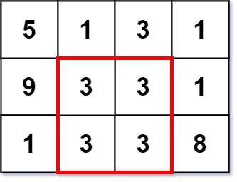

一个 k x k 的 **幻方** 指的是一个 k x k 填满整数的方格阵，且每一行、每一列以及两条对角线的和 **全部相等** 。幻方中的整数 **不需要互不相同** 。显然，每个 1 x 1 的方格都是一个幻方。

给你一个 m x n 的整数矩阵 grid ，请你返回矩阵中 **最大幻方** 的 **尺寸** （即边长 k）。

 

**示例 1：**

```
输入：grid = [[7,1,4,5,6],[2,5,1,6,4],[1,5,4,3,2],[1,2,7,3,4]]
输出：3
解释：最大幻方尺寸为 3 。
每一行，每一列以及两条对角线的和都等于 12 。
- 每一行的和：5+1+6 = 5+4+3 = 2+7+3 = 12
- 每一列的和：5+5+2 = 1+4+7 = 6+3+3 = 12
- 对角线的和：5+4+3 = 6+4+2 = 12
```
**示例 2：**

```
输入：grid = [[5,1,3,1],[9,3,3,1],[1,3,3,8]]
输出：2
```

**提示：**

* ```m == grid.length```
* ```n == grid[i].length```
* ```1 <= m, n <= 50```
* ```1 <= grid[i][j] <= 10^6```

来源：力扣（LeetCode）
链接：https://leetcode-cn.com/problems/largest-magic-square
著作权归领扣网络所有。商业转载请联系官方授权，非商业转载请注明出处。