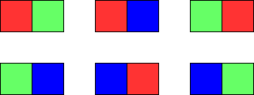

给你两个整数 m 和 n 。构造一个 m x n 的网格，其中每个单元格最开始是白色。请你用 **红、绿、蓝** 三种颜色为每个单元格涂色。所有单元格都需要被涂色。

涂色方案需要满足：**不存在相邻两个单元格颜色相同的情况** 。返回网格涂色的方法数。因为答案可能非常大， 返回 **对** ```10^9 + 7``` **取余** 的结果。

 

**示例 1：**

```
输入：m = 1, n = 1
输出：3
解释：如上图所示，存在三种可能的涂色方案。
```
**示例 2：**

```
输入：m = 1, n = 2
输出：6
解释：如上图所示，存在六种可能的涂色方案。
```
**示例 3：**
```
输入：m = 5, n = 5
输出：580986
```

**提示：**

* ```1 <= m <= 5```
* ```1 <= n <= 1000```

来源：力扣（LeetCode）
链接：https://leetcode-cn.com/problems/painting-a-grid-with-three-different-colors
著作权归领扣网络所有。商业转载请联系官方授权，非商业转载请注明出处。